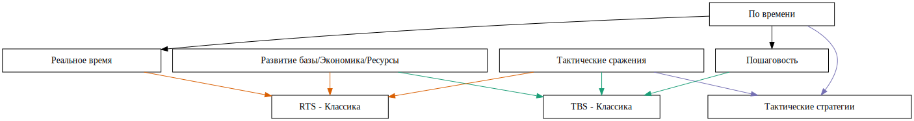

Для реактирования диаграмм используется [graphviz dot](https://graphviz.org/).
Рекомендуется устновить расширение на vs code
[Graphviz (dot) language support for Visual Studio Code](https://marketplace.visualstudio.com/items?itemName=joaompinto.vscode-graphviz)
для комфортного редактирования диаграмм.

